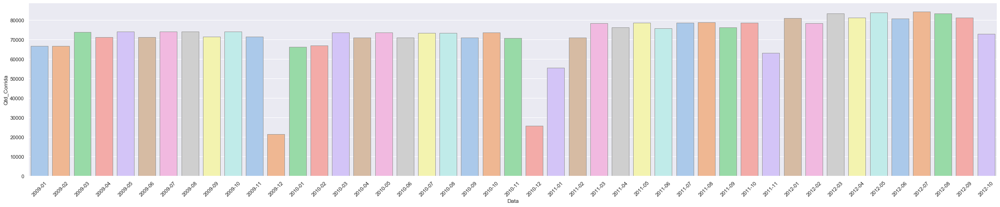
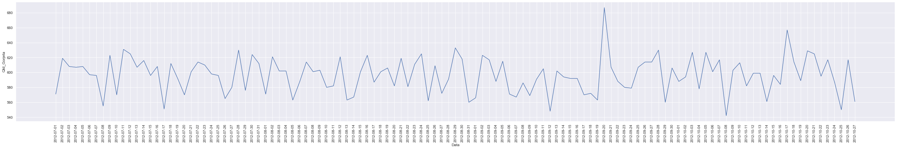
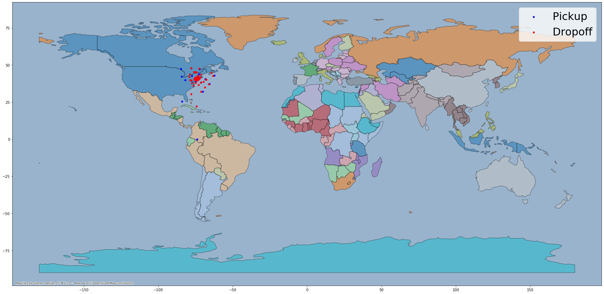

```python
import os
import pandasql          as ps
import pandas            as pd
import numpy             as np
from numpy.random        import randn

import geopandas         as gpd
from shapely.geometry    import Point, MultiPoint, Polygon
from shapely             import wkt
import descartes
import seaborn           as sns
import matplotlib.pyplot as plt
import contextily        as ctx
from pyproj              import CRS

%matplotlib inline
pd.set_option('display.max_colwidth', -1) 
```

    /Users/edsongr/opt/anaconda3/envs/EDSON_ENV/lib/python3.6/site-packages/ipykernel_launcher.py:17: FutureWarning: Passing a negative integer is deprecated in version 1.0 and will not be supported in future version. Instead, use None to not limit the column width.


# Extract


```python
# Caminho local dos arquivos 
path = '/Users/edsongr/Downloads/'

# Datasets
files = ['data-payment_lookup-csv.csv',
         'data-vendor_lookup-csv.csv',
         'data-sample_data-nyctaxi-trips-2009-json_corrigido.json',
         'data-sample_data-nyctaxi-trips-2010-json_corrigido.json',
         'data-sample_data-nyctaxi-trips-2011-json_corrigido.json',
         'data-sample_data-nyctaxi-trips-2012-json_corrigido.json'
        ]

```

# Load


```python
index = 1

# Carregando datasets
for i in files: 
    if i.find('.csv') != -1:
        globals()['df' + str(index)] = pd.read_csv(path + str(i) ,sep=',',low_memory=False)
        print('df' + str(index))
        index = index+1
    else:
        globals()['df' + str(index)] = pd.read_json(path + str(i),lines=True)
        print('df' + str(index))
        index = index+1
```

    df1
    df2
    df3
    df4
    df5
    df6


# Transformation


```python
#Unindo datasets
df_t                      = pd.concat([df3,df4,df5,df6]); 

#Normalizando coluna tipo de pagamento
df_t['payment_type']      = df_t['payment_type'].str.upper();
#Coluna aaaa-mm-dd aux
df_t['pickup_datetime_2'] = df_t['pickup_datetime'].str[:10];
#Coluna aaaa-mm
df_t['pickup_datetime_3'] = df_t['pickup_datetime'].str[:7];
#Coluna aaaa
df_t['pickup_datetime_4'] = df_t['pickup_datetime'].str[:4];
#Criando coluna dia da semana
df_t['day_of_week']       = pd.DatetimeIndex(df_t['pickup_datetime_2']).day_name();
#Tempo das corridas
df_t['trip_duration']     = pd.to_datetime(df_t['dropoff_datetime']) - pd.to_datetime(df_t['pickup_datetime']);
#Criando dados geográficos 

#Eliminando coordenadas incorretas
temp    = df_t[['pickup_datetime_4','pickup_longitude','pickup_latitude']].query('(pickup_longitude <= -37.0902 | pickup_latitude >= 95.7129) & pickup_datetime_4 == "2010"');

temp2   = df_t[['pickup_datetime_4','dropoff_longitude','dropoff_latitude']].query('(dropoff_longitude <= -37.0902 | dropoff_latitude >=95.7129) & pickup_datetime_4 == "2010"');

temp    = temp[['pickup_longitude','pickup_latitude']].drop_duplicates();

temp2   = temp2[['dropoff_longitude','dropoff_latitude']].drop_duplicates();

geo_df  = gpd.GeoDataFrame(temp,geometry=gpd.points_from_xy(temp["pickup_longitude"], temp["pickup_latitude"]));

geo_df2 = gpd.GeoDataFrame(temp2,geometry=gpd.points_from_xy(temp2["dropoff_longitude"], temp2["dropoff_latitude"]));

```

## 1. Qual a distância média percorrida por viagens com no máximo 2 passageiros ?


```python
#Python

result = (df_t
          .query('passenger_count <= 2')
          .agg({'trip_distance':np.mean})
         ).to_frame()

result.rename(columns={0: 'avg_trip_distance'}, inplace=True)

display(result)

```


<div>
<style scoped>
    .dataframe tbody tr th:only-of-type {
        vertical-align: middle;
    }

    .dataframe tbody tr th {
        vertical-align: top;
    }

    .dataframe thead th {
        text-align: right;
    }
</style>
<table border="1" class="dataframe">
  <thead>
    <tr style="text-align: right;">
      <th></th>
      <th>avg_trip_distance</th>
    </tr>
  </thead>
  <tbody>
    <tr>
      <td>trip_distance</td>
      <td>2.662527</td>
    </tr>
  </tbody>
</table>
</div>


```python
#SQL

sql = """SELECT 
            AVG(trip_distance) avg_trip_distance
         FROM df_t 
         WHERE 
            passenger_count <= 2; 
      """
result = ps.sqldf(sql, locals())

display(result)
```


<div>
<style scoped>
    .dataframe tbody tr th:only-of-type {
        vertical-align: middle;
    }

    .dataframe tbody tr th {
        vertical-align: top;
    }

    .dataframe thead th {
        text-align: right;
    }
</style>
<table border="1" class="dataframe">
  <thead>
    <tr style="text-align: right;">
      <th></th>
      <th>avg_trip_distance</th>
    </tr>
  </thead>
  <tbody>
    <tr>
      <td>0</td>
      <td>2.662527</td>
    </tr>
  </tbody>
</table>
</div>


# 2. Quais os 3 maiores vendors em quantidade total de dinheiro arrecadado ?


```python
#Python

result = (pd.merge(df_t, df2, on='vendor_id')
                .groupby(['name'],as_index=False)
                .agg({'total_amount':np.sum}).round(decimals=3)
                .sort_values(by=['total_amount'],ascending=False)
                .head(3)
         )

hist.rename(columns={'name': 'vendor'}, inplace=True)

display(result)
```


<div>
<style scoped>
    .dataframe tbody tr th:only-of-type {
        vertical-align: middle;
    }

    .dataframe tbody tr th {
        vertical-align: top;
    }

    .dataframe thead th {
        text-align: right;
    }
</style>
<table border="1" class="dataframe">
  <thead>
    <tr style="text-align: right;">
      <th></th>
      <th>name</th>
      <th>total_amount</th>
    </tr>
  </thead>
  <tbody>
    <tr>
      <td>0</td>
      <td>Creative Mobile Technologies, LLC</td>
      <td>19549084.28</td>
    </tr>
    <tr>
      <td>3</td>
      <td>VeriFone Inc</td>
      <td>19043434.00</td>
    </tr>
    <tr>
      <td>1</td>
      <td>Dependable Driver Service, Inc</td>
      <td>2714901.72</td>
    </tr>
  </tbody>
</table>
</div>


```python
#SQL

sql = """SELECT
            name                       vendor,    
            ROUND(SUM(total_amount),3) total_amount
         FROM df_t 
         INNER JOIN df2 ON df2.vendor_id = df_t.vendor_id 
         GROUP BY
             name
         ORDER BY
             2 DESC
         LIMIT 3; 
      """
result = ps.sqldf(sql, locals())

display(result)
```


<div>
<style scoped>
    .dataframe tbody tr th:only-of-type {
        vertical-align: middle;
    }

    .dataframe tbody tr th {
        vertical-align: top;
    }

    .dataframe thead th {
        text-align: right;
    }
</style>
<table border="1" class="dataframe">
  <thead>
    <tr style="text-align: right;">
      <th></th>
      <th>vendor</th>
      <th>total_amount</th>
    </tr>
  </thead>
  <tbody>
    <tr>
      <td>0</td>
      <td>Creative Mobile Technologies, LLC</td>
      <td>19549084.28</td>
    </tr>
    <tr>
      <td>1</td>
      <td>VeriFone Inc</td>
      <td>19043434.00</td>
    </tr>
    <tr>
      <td>2</td>
      <td>Dependable Driver Service, Inc</td>
      <td>2714901.72</td>
    </tr>
  </tbody>
</table>
</div>


### 3. Faça um histograma da distribuição mensal, nos 4 anos, de corridas pagas em dinheiro;


```python
#Python
#Criando universo a ser exibido
hist = (df_t
        .query('payment_type  == "CASH"')
        .groupby(['pickup_datetime_3'],as_index=False)
        .agg({'pickup_datetime':np.count_nonzero}).round(decimals=3)
        .sort_values(by=['pickup_datetime_3'],ascending=True)
       );

hist.rename(columns={'pickup_datetime_3': 'Data', 'pickup_datetime': 'Qtd_Corrida'}, inplace=True)

g = sns.catplot(y="Qtd_Corrida", x="Data", kind="bar",palette="pastel", edgecolor=".6",data=hist,height=6, aspect=5);
g.set_xticklabels(rotation=45)
```


    <seaborn.axisgrid.FacetGrid at 0x1b07ec9890>





```python
#SQL
#Criando universo a ser exibido
sql = """SELECT
            pickup_datetime_3   Data,    
            COUNT()             Qtd_Corrida
         FROM df_t 
         WHERE
           payment_type  = 'CASH'  
         GROUP BY
             pickup_datetime_3; 
      """
hist = ps.sqldf(sql, locals())

g = sns.catplot(y="Qtd_Corrida", x="Data", kind="bar",palette="pastel", edgecolor=".6",data=hist,height=6, aspect=5);
g.set_xticklabels(rotation=45)
```


    <seaborn.axisgrid.FacetGrid at 0x1a1986a390>


#### 4. Faça um gráfico de série temporal contando a quantidade de gorjetas de cada dia, nos últimos 3 meses de 2012.


```python
#Python

num_meses    = 3 
end_date     = df_t[['pickup_datetime_3']][(df_t['pickup_datetime'].str[:4] == '2012')].max()
start_date   = (
                end_date
                .str[:4] +
                '-'      +
                "{:02d}".format((int(end_date.str[-2:]) - num_meses))
               )

hist = (df_t
        .query('pickup_datetime_3.values >= @start_date.values & pickup_datetime_3.values <= @end_date.values & tip_amount != 0')
        .groupby(['pickup_datetime_2'],as_index=False)
        .agg({'pickup_datetime':np.count_nonzero}).round(decimals=3)
        .sort_values(by=['pickup_datetime_2'],ascending=True)
       );

hist.rename(columns={'pickup_datetime_2': 'Data', 'pickup_datetime': 'Qtd_Gorjeta'}, inplace=True)

g = sns.relplot(x="Data", y="Qtd_Gorjeta", kind="line", data=hist, height=6, aspect=6.5)
g.set_xticklabels(rotation=90)

```


    <seaborn.axisgrid.FacetGrid at 0x1afc733250>





```python
#SQL

num_meses    = 3 
end_date     = (df_t[['pickup_datetime_3']][(df_t['pickup_datetime'].str[:4] == '2012')].max())
start_date   = (
                    end_date
                    .str[:4] +
                    '-'      +
                    "{:02d}".format((int(end_date.str[-2:]) - num_meses))
                )

#Recuperando somente o valor para motagem da query dinâmica
end_date   = end_date.values[0]
start_date = start_date.values[0]

sql = "SELECT pickup_datetime_2 Data, COUNT() Qtd_Gorjeta FROM df_t WHERE pickup_datetime_3 >= '" +start_date+"' AND pickup_datetime_3 <= '" +end_date+"' AND tip_amount != 0 GROUP BY pickup_datetime_2;"

hist = ps.sqldf(sql, locals())

g = sns.relplot(x="Data", y="Qtd_Gorjeta", kind="line", data=hist, height=6, aspect=6.5)
g.set_xticklabels(rotation=90)
```


    <seaborn.axisgrid.FacetGrid at 0x1afd5f0310>


# Qual o tempo médio das corridas nos dias de sábado e domingo ?


```python
result =(df_t
            .query('day_of_week in ("Saturday","Sunday")')
            .agg({'trip_duration':np.mean})
        ).to_frame()

result.rename(columns={0: 'avg_trip_duration'}, inplace=True)

display(result)
```


<div>
<style scoped>
    .dataframe tbody tr th:only-of-type {
        vertical-align: middle;
    }

    .dataframe tbody tr th {
        vertical-align: top;
    }

    .dataframe thead th {
        text-align: right;
    }
</style>
<table border="1" class="dataframe">
  <thead>
    <tr style="text-align: right;">
      <th></th>
      <th>avg_trip_duration</th>
    </tr>
  </thead>
  <tbody>
    <tr>
      <td>trip_duration</td>
      <td>00:08:44.790923</td>
    </tr>
  </tbody>
</table>
</div>


### Fazer uma visualização em mapa com latitude e longitude de pickups and dropoffs no ano de 2010


```python

#street_map = gpd.read_file(gpd.datasets.get_path('nybb'));
#street_map = street_map.to_crs(epsg=4326);

street_map = gpd.read_file(gpd.datasets.get_path('naturalearth_lowres'));
street_map[street_map['name'] == 'United States of America'];
street_map = street_map.to_crs(epsg=4326);
#street_map = street_map.to_crs(epsg=3857);
ax         = street_map.plot(figsize=(30, 30), alpha=0.5, edgecolor='k',cmap='tab20');
#ax         = street_map.plot(figsize=(15, 15), alpha = 0.4, color="grey");
#ax         = street_map.plot(figsize=(15, 15), alpha=0.5,);

#street_map.plot(ax = ax, alpha = 0.4, color="grey")

#geo_df.plot(ax = ax, markersize = 20, color = "blue", marker = "o", label = "Pickup" );
#geo_df2.plot(ax = ax, markersize = 20, color = "red", marker = "o", label = "Dropoff" );

#geo_df[:100].plot(ax = ax, markersize = 20, color = "blue", marker = "o", label = "Pickup" )
#geo_df2[:100].plot(ax = ax, markersize = 20, color = "red", marker = "o", label = "Dropoff" );

plt.legend(prop={'size': 15});
ctx.add_basemap(ax,zoom=10);

```




